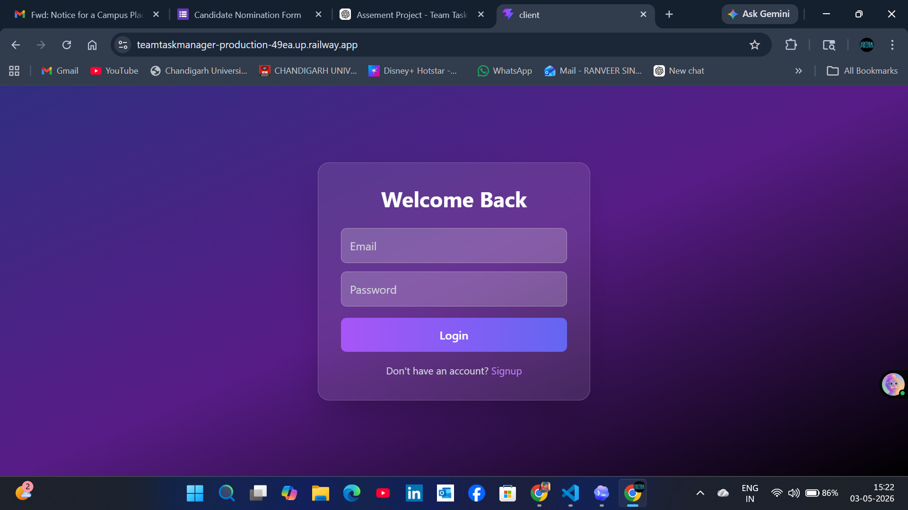
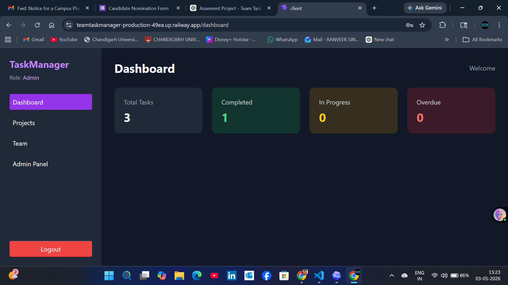
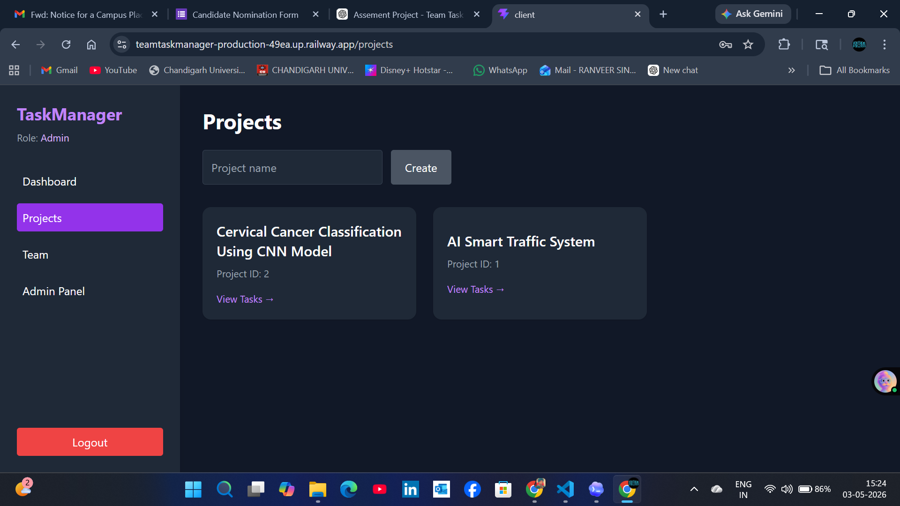
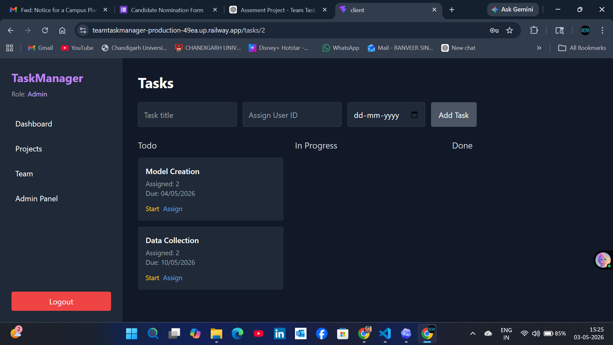

# 🚀 TeamTaskManager

A full-stack web application to manage projects, tasks, and team collaboration efficiently. Built with modern technologies and deployed on the cloud.

---

## 🌐 Live Demo

* 🔗 Frontend: https://teamtaskmanager-production-49ea.up.railway.app
* 🔗 Backend API: https://teamtaskmanager-production-f26f.up.railway.app/api

---

## ✨ Highlights

* Secure authentication using JWT
* Role-based access control (Admin / Member)
* Real-time task tracking and project management
* Fully deployed and production-ready

---

## 📌 Features

* 🔐 User Authentication (Login / Signup)
* 👥 Role-based Access Control
* 📁 Project Management
* ✅ Task Management
* 👨‍👩‍👧 Team Collaboration
* 📊 Dashboard Overview

---

## 🛠️ Tech Stack

### Frontend

* React (Vite)
* Axios
* React Router
* Tailwind CSS

### Backend

* Node.js
* Express.js
* Sequelize ORM
* MySQL

---

## 📂 Project Structure

```
TeamTaskManager/
├── client/
├── server/
│   ├── models/
│   ├── routes/
│   ├── controllers/
```

---

## ⚙️ Installation

### Backend

```
cd server
npm install
```

Create `.env`:

```
PORT=5000
DB_NAME=your_db
DB_USER=root
DB_PASSWORD=your_password
JWT_SECRET=your_secret
CLIENT_URL=http://localhost:5173
```

Run:

```
npm run dev
```

---

### Frontend

```
cd client
npm install
```

Create `.env`:

```
VITE_API_URL=http://localhost:5000/api
```

Run:

```
npm run dev
```

---

## 🔗 API Endpoints

* Auth → `/api/auth`
* Projects → `/api/projects`
* Tasks → `/api/tasks`
* Team → `/api/team`
* Users → `/api/users`

---

## 🚀 Deployment

* Deployed using Railway
* Environment variables configured
* Secure CORS implemented

---

## 📸 Screenshots

### 🔐 Login Page



### 📊 Dashboard



### 📁 Projects Page



### ✅ Tasks Page



---

## 📈 Future Improvements

* Task status workflow
* Notifications
* File uploads
* Analytics dashboard
* Dark mode

---

## 👨‍💻 Author

**Ranveer Singh**

* GitHub: https://github.com/Ranveer1509
* Email: [ranveersinghmandhal380@gmail.com](mailto:ranveersinghmandhal380@gmail.com)

---

⭐ Star this repo if you like it!
